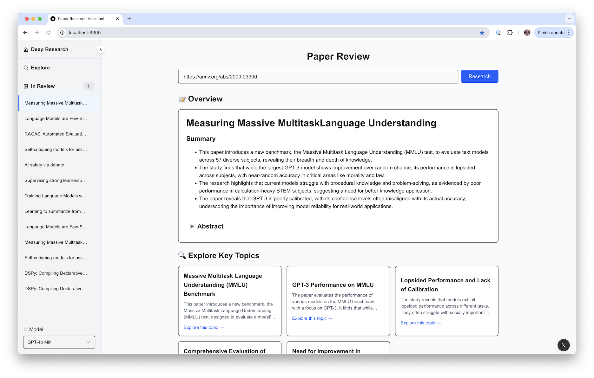

# Paper Research Assistant

## Overview

A web-based research assistant that helps users explore and analyze academic papers. The application features a modern web interface with a tab-based research system and supports multiple AI models for paper analysis.

There are a few options:

- **Single-paper Summarization**: Summarize a paper, pull out key topics for analysis and allow for open-ended questions of that paper.
- **Explore**: As open-ended questions against a corpus of papers crawled into our vector store (see [backend/apptasks/](backend/app/tasks))
- **Deep Research**: A OpenAI/Google deep research-style searching of the web for pages related to a given paper. Can use either text-based browsing or a web agent like [browser-use](https://github.com/browser-use/browser-use).



### Uses:

- [smolagents](https://github.com/huggingface/smolagents) for the agents
- [QDrant](https://qdrant.tech/) as a Vector DB
- [LiteLLM](https://www.litellm.ai/) for interacting with AI providers
- [Railway](https://railway.com/) for deployments
- [FastAPI](https://fastapi.tiangolo.com/) and [Next.JS](https://nextjs.org/)

### Key Features

- Interactive research interface with multiple tabs
- Paper exploration and deep research capabilities
- Support for multiple AI models
- Persistent storage of research sessions
- Real-time paper analysis

## Development Setup

### Prerequisites

- Python 3.13+
- Node.js 18+
- [uv](https://github.com/astral/uv) for Python dependency management
- Various API keys for AI services

### Backend Setup

1. Clone the repository
2. Navigate to the backend directory
3. Set up the environment with uv:

```bash
curl -LsSf https://astral.sh/uv/install.sh | sh
uv venv
source .venv/bin/activate
```

4. Install dependencies:

```bash
uv pip install -e .
```

5. Copy `.env.example` to `.env` and configure the keys.

6. Start the backend server:

```bash
fastapi dev main.py
```

### Frontend Setup

1. Navigate to the frontend directory
2. Install dependencies:

```bash
npm install
```

3. Start the development server:

```bash
npm run dev
```

The frontend is built with:

- Next.js 15.2.0
- React 19
- TailwindCSS
- TypeScript

## Development Commands

Backend:

- Install dev dependencies: `uv pip install -e ".[dev]"`
- Format code: `black .`
- Lint: `ruff check`
- Type checking: `mypy`
- Run tests: `pytest`

Frontend:

- Development server: `npm run dev`
- Build: `npm run build`
- Start production server: `npm run start`
- Lint: `npm run lint`
- Format code: `npm run format`

## CI/CD

### GitHub Actions

The project uses three main GitHub Actions workflows which run on PRs:

1. **Python Static Analysis**: Runs `black` (formatting), `ruff` (lint) and `mypy` (type checking) against all python code.
2. **Frontend Linting**: Runs `eslint` against all code in `frontend`.
3. **Python Tests**: Runs `pytest` suite in `backend/app/tests`.

## Deployment

The application automatically deploys to [Railway](https://railway.com) when changes are merged to the main branch.
